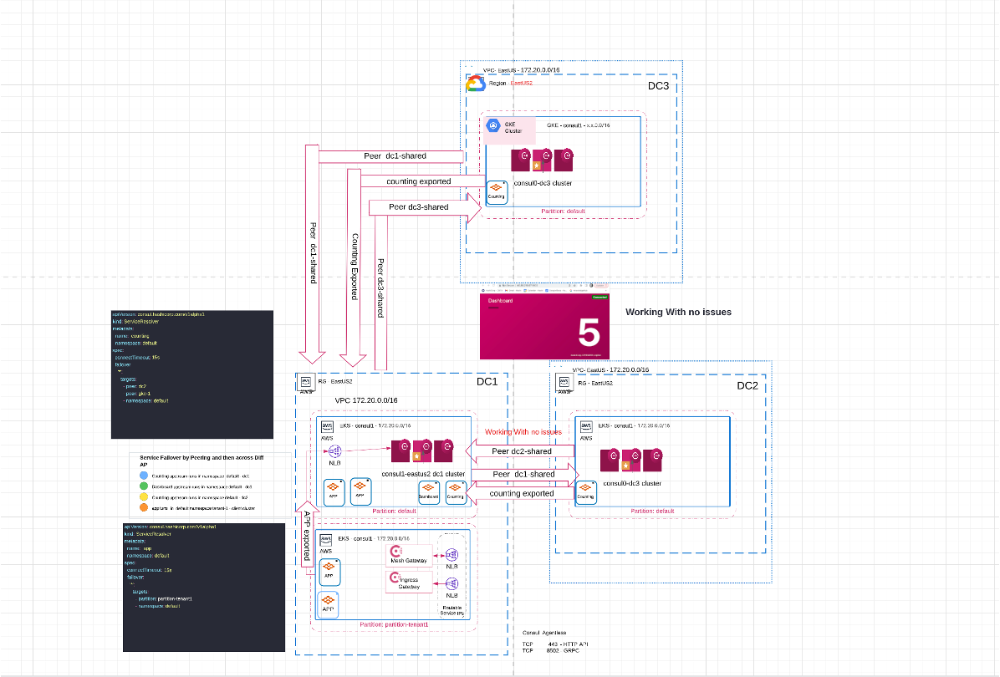

**Disclaimer: This setup is for POC purposes and not fit for production**

#   Consul SA Demo





Peering of DCs

Helm chart in the DC1 directory and the config files are all in DC1/01-AP-default-default-failover/countingapp

Helm chart in the DC2 directory and the config files are all in DC2/01-AP-default-default-failover/countingapp

DC1 configuration -----> DC1/consul-values & /CRDS

DC2 configuration -----> tenant-1/consul-values & /CRDS

Admin Partition on client clusters

Helm chart in the consul-values directory and the config files are all in DC1/

Helm chart in the tenant-1 directory and the config files are all in tenant-1/

DC1 configuration -----> DC1

DC2 configuration -----> DC1/Tenant-1/

DC3 configuration -----> GKE/


This demo will showcase the ability to failover services between Admin Partitions Consul datacenters (dc1 and tenant-1 and DC3) that have been connected via consul dataplance and Cluster peering to DC3.

We will deploy a counting app where a dashboard service will connect to the upstream counting service. counting services will reside on each DC and tenant to show failover.

We will have another instance of the counting service running on dc2. We will similate a failure of the counting service on dc1 by taking down the whole counting service deployment. 

We will then observe how the dashboard will failover to the counting service residing in the other admin partition and finally remote DC.

# Pre-reqs

1. You have three Kubernetes clusters available. In this demo example, we will use Azure Kubernetes Service (AKS) for two and GKe for third.


    Note: 
    - If using AKS, you can use the Kubenet CNI. The Consul control plane and data plane will use Load Balancers (via Consul mesh gateways)to communicate between Consul datacenters.
    - Since Load Balancers are used on both control plane and data plane, each datacenter can reside on different networks (VNETS, VPCs) or even different clouds (AWS, Azure GCP, private, etc). No direct network connections (ie peering connections) are required. 
    
2. Add or update your hashicorp helm repo:

```
helm repo add hashicorp https://helm.releases.hashicorp.com
```
or
```
helm repo update hashicorp
```

  
# Deploy Consul on first Kubernetes cluster (dc1).

1 If required there is a Terraform code to deploy a cluster ---> DC1/

2 You can run terraform plan and deploy within the directory to build a cluster will take several minutes

Run the following command to retrieve the access credentials for your cluster and automatically configure kubectl.

```aws eks --region $(terraform output -raw region) update-kubeconfig --name $(terraform output -raw cluster_name)```


You can then run the command kubectl cluster-info to verify you are connected to your Kubernetes cluster:

3. Set environemetal variables for kubernetes cluster dc1 and dc2 (Optional)

```
export dc1=<your-kubernetes context-for-dc1>
export dc2=<your-kubernetes context-for-dc2>
export VERSION=1.0.0
```

4. Set context and deploy Consul on dc1

```
kubectl config use-context $dc1

create consul namespace

```
kubectl create namespace consul                                
```

deploy license file into the consul namespace as shown below
``` 

```
kubectl create secret generic consul-ent-license --namespace consul --from-literal=key="$consul.hclic"

helm install $dc1 hashicorp/consul --version $VERSION --values config-dc1.yaml                                  
```

5. Confirm Consul deployed sucessfully

```
kubectl get pods --context $dc1
NAME                                               READY   STATUS    RESTARTS   AGE

dc1-consul-connect-injector-6694d44877-jvp4s       1/1     Running   0          2m
dc1-consul-mesh-gateway-747c58b75c-s68n7           2/2     Running   0          2m
dc1-consul-server-0                                1/1     Running   0          2m
dc1-consul-webhook-cert-manager-669bb6d774-sb5lz   1/1     Running   0          2m
```  
Note: Run ```kubectl get crd``` and make sure that exportedservices.consul.hashicorp.com, peeringacceptors.consul.hashicorp.com, and peeringdialers.consul.hashicorp.com  exist.    
If not, you need to upgrade your helm deployment:  

Sometimes not all CRDS get deployed first time 
    
```
helm upgrade --install $dc1 hashicorp/consul  --version $VERSION --values config-dc1.yaml
```
cd scripts

6. Deploy both dashboard and counting service on dc1
```
files located in DC1/scripts/counting.yaml & dashboard.yaml
kubectl apply -f dashboard.yaml --context $dc1
kubectl apply -f counting.yaml --context $dc1
```


7. Using your browser, check the dashboard UI and confirm the number displayed is incrementing. 
   You can get the dashboard UI's EXTERNAL IP address with command below. Make sure to append port :9002 to the browser URL.  
```   
kubectl get service dashboard --context $dc1
```

Example: 
```
kubectl get service dashboard --context $dc1
NAME        TYPE           CLUSTER-IP     EXTERNAL-IP      PORT(S)          AGE
dashboard   LoadBalancer   10.0.179.160   40.88.218.67  9002:32696/TCP   22s
```


# Deploy Consul on second Kubernetes tenant cluster.

8. You will need to export secrets from dc1 to tenant cluster to allow connectivity, take note of the context of tenant-1 cluster using the below command
   
```
kubectl config get-clusters                               
```   
Once on the tenant cluster 

create namespace and install the license also into the consul namespace

```
create consul namespace
```

```
kubectl create namespace consul                                
```

deploy license file into the consul namespace as shown below

```
kubectl create secret generic consul-ent-license --namespace consul --from-literal=key="$consul.hclic"                               
```

once completed move to dc1 primary cluster 

Copy the server certificate to the non-default partition cluster running your workloads

once you have the context of the tenant cluster, copy the below secrets from dc1 cluster to the tenant-1 partition cluster

```
kubectl get secret --namespace consul consul-ca-cert -o yaml | \
kubectl --context arn:aws:eks:eu-west-1:865587657226:cluster/jase2-eks-U2B4YjPi apply --namespace consul -f -

kubectl get secret --namespace consul consul-ca-key -o yaml | \
kubectl --context arn:aws:eks:eu-west-1:865587657226:cluster/jase2-eks-U2B4YjPi apply --namespace consul -f -

kubectl get secret --namespace consul consul-partitions-acl-token -o yaml | \
kubectl --context arn:aws:eks:eu-west-1:865587657226:cluster/jase2-eks-U2B4YjPi apply --namespace consul -f -
                                
```
before moving to tenant cluster take note of the consul-expose-servers load balancer for tenant-1 connectivity, you will need this in helm chart configuration

```
kubectl get svc -n consul # on DC1

NAME                             TYPE           CLUSTER-IP       EXTERNAL-IP                                                               PORT(S)
consul-consul-expose-servers     LoadBalancer   172.20.230.215   a1fecfc8ccdd74b37b5273d7da904e79-1244336522.us-east-2.elb.amazonaws.com   8501:31424/TCP,8301:30094/TCP,8300:31439/TCP,8502:31755/TCP

```


Once secrets have been copied, move to tenant cluster and prepare for consul installation

Run the following command to retrieve the access cli credentials for the cluster, use the Kubernetes control plane config that is displayed

find kubernetes master on the client side kubernetes cluster, place the master aputput into the k8sAuthMethodHost: 


```
kubectl cluster-info 

Kubernetes master is running at https://6FA8E20A2D3D90DC7DFC6B39B761BE52.sk1.us-east-2.eks.amazonaws.com
CoreDNS is running at https://6FA8E20A2D3D90DC7DFC6B39B761BE52.sk1.us-east-2.eks.amazonaws.com/api/v1/namespaces/kube-system/services/kube-dns:dns/proxy

```


The helm chart in /tenant-1/consul values directory has previous configs, amend this with the information that you have xtracted from the above configs


install helm chart also into the consul namespace


kubectl config use-context $dc2

```
helm install $dc2 hashicorp/consul --version $VERSION --values config-dc2.yaml --set global.datacenter=dc2                              
```

```
kubectl get pods -n consul

NAME                                 READY   STATUS      RESTARTS   AGE
consul-consul-partition-init-zzmsz   0/1     Completed   0          3h52m

```

Note: now uding consul dataplane no client pods have been created as with previous versions without datapane 

```
kubectl get crd                         
```

and make sure that exportedservices.consul.hashicorp.com, peeringacceptors.consul.hashicorp.com, and peeringdialers.consul.hashicorp.com  exist.    
If not, you need to upgrade your helm deployment:  

```
helm upgrade --install $dc2 hashicorp/consul  --version $VERSION --values config-dc2.yaml
```

10. Deploy counting service on dc2. This will be the failover service instance.

files can be located in tenant-1/scripts/counting.yaml

```
kubectl apply -f counting.yaml --context $dc2
```
Deploy CRDS and this will provide the connection 

ADMIN PARTITIONS COMPLETED.....

# Create cluster peering connection

You can establish the peering connections using the Consul UI or using Kubernetes CRDs. The steps using the UI are extremely easy and straight forward so we will focus on using the Kubernetes CRDs in this section.

11.  If your Consul clusters are on different non-routable networks (no VPC/VPN peering), then you will need to set the Consul servers (control plane) to use mesh gateways to request/accept peering connection. Just apply the meshgw.yaml file on both Kubernetes cluster. 

If you try to establish a peer and get the following error below you will need to deploy the mesh gateways

```
kubectl apply -f meshgw.yaml --context $dc1
kubectl apply -f meshgw.yaml --context $dc5
```


You can either use the UI or configuration to setup peering, UI pretty straightforwad to follow

**If you prefer to use the UI to establish the peered connection, the general steps are:**
  - Log onto Consul UI for dc1, navigate to the Peers side tab on the left hand side.
  - Click on **Add peer connection***
  - Enter a name you want to represent the peer that you are connecting to. 
  - Click **Generate token**
  - Copy the newly created token.
  - Log onto Consul UI for dc5, navigate to the Peers side tab on the left hand side.
  - Click on **Add peer connection***
  - Click on **Establish peering**
  - Enter a name you want to represent the peer that you are connecting to.
  - Paste the token and click **Add peer**
  - Your peering connection should be established.


**To establish the peered connection using Kubernetes CRDs, the steps are:**


12. Create Peering Acceptor on dc1 using the provided acceptor-on-dc1-for-dc2.yaml file.
Note: This step will establish dc1 as the Acceptor.
```
kubectl apply -f  acceptor-on-dc1-for-dc2.yaml --context $dc1
```

12. Notice this will create a CRD called peeringacceptors.
```
kubectl get peeringacceptors --context $dc1
NAME   SYNCED   LAST SYNCED   AGE
dc5    True     2m46s         2m47s
```

Notice a secret called peering-token-dc2 is created.

All files located in DC1/countingapp/
```
kubectl get secrets --context $dc1
```

13. Copy peering-token-dc3 from dc1 to dc5.
```
kubectl get secret peering-token-dc2 --context $dc1 -o yaml | kubectl apply --context $dc2 -f -
```

14. Create Peering Dialer on dc5 using the provided dialer-dc2.yaml file.  

Note: This step will establish dc3 as the Dialer and will connect Consul on dc5 to Consul on dc1 using the peering-token.
```
kubectl apply -f  dialer-dc2.yaml --context $dc5
```

15. Export counting service from dc5 to dc1.


```
kubectl apply -f exportedsvc-counting.yaml --context $dc5
```


16. Apply service-resolver file on dc1. This service-resolver.yaml file will tell Consul on dc1 how to handle failovers if the counting service fails locally. 

Note: Make sure the name of the peer in the service-resolver file matches the name to gave for each peer when you established peering (either in the UI or using CRD acceptor and dialer files).

```
kubectl apply -f service-resolver.yaml --context $dc1
```

17. If you have deny-all intentions set or if ACL's are enabled (which means deny-all intentions are enabled), set intentions using intention.yaml file.  

Note: The UI on Consul version 1.14 does not yet recognize peers for Intention creation. Therefore apply intentions using the CLI, API, or CRDs.

```
kubectl apply -f intentions.yaml --context $dc5
```


18. Apply the proxy-defaults on both datacenters to ensure data plane traffic goes via local mesh gateways 
```
kubectl apply -f proxydefaults.yaml --context $dc1
kubectl apply -f proxydefaults.yaml --context $dc5
```

19. Edit the service-resolver.yaml file by adding ```- peer: 'dc3'``` as one of the targets. 

It should look like below. Make sure the name of the peer in the service-resolver file matches the name to gave for each peer when you established peering (either in the UI or using CRD acceptor and dialer files).
```
apiVersion: consul.hashicorp.com/v1alpha1
kind: ServiceResolver
metadata:
  name: counting
spec:
  connectTimeout: 15s
  failover:
    '*':
      targets:
      - service: "counting"
      - namespace: "default"
      - partition: "tenant-1"
#     - peer: 'dc2'
      - peer: 'dc5'
```

20. Apply the file to dc1
```
kubectl apply -f service-resolver.yaml --context $dc1
```


21. Delete the counting service on dc1
```
kubectl delete -f counting.yaml --context $dc1
```

22. Observe the dashboard service on your browser. You should notice that the counter has restarted since the dashboard is connecting to different counting service instance.


**This is your current configuration:**  


23. Bring counting service on dc1 back up.
```
kubectl apply -f counting.yaml --context $dc1
```


24. Observe the dashboard service on your browser. Notice the the dashboard URL shows the counter has restarted again since it automatically fails back to the original service on dc1.


	
25. If you have deny-all intentions set or if ACL's are enabled (which means deny-all intentions are enabled), set intentions using intention.yaml file.
```
kubectl apply -f intentions.yaml --context $dc3
```


