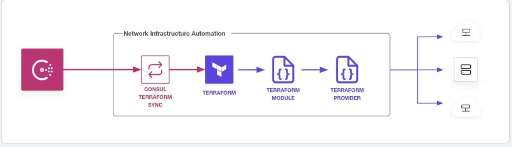
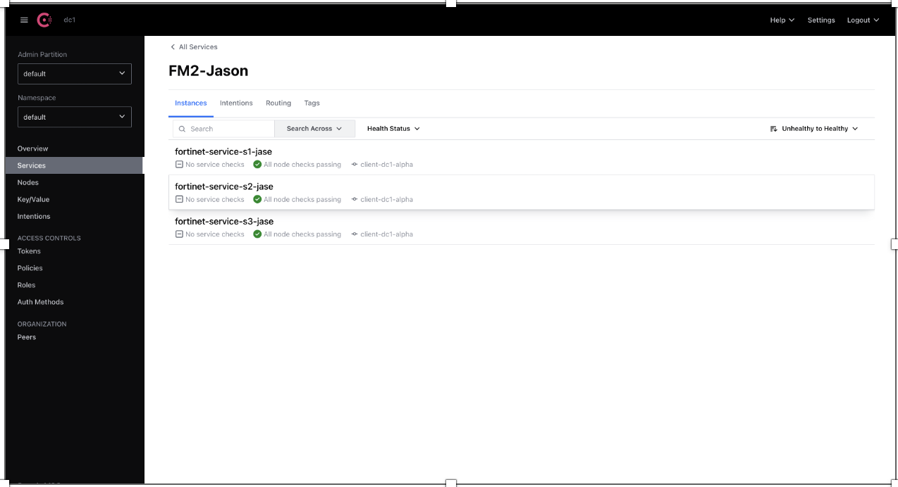
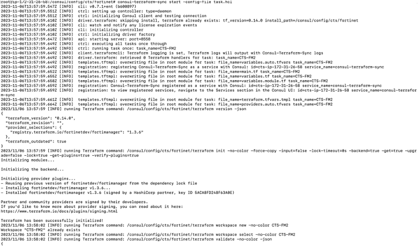

Disclaimer: This setup is for POC purposes and not fit for production

CTS & fortimanager instructions Guide

This guide will show how to register services to consul and sync to Fortimanager with a simple service

If you havent already done it make sure you have exported your token to provide permissions

```
export CONSUL_HTTP_TOKEN=
```

```
consul register FM2.json
consul register FM3.json
consul register FM4.json

```

You will see that the services register all 3 instances of the services




once you have tested that services are registered and you have permission for service registry
de register the services and then we can start to test CTS for Fortimanager

```
consul deregister FM2.json
consul deregister FM3.json
consul deregister FM4.json

```
Within the task file you need to provide the credentials to access fortimanger and the correct address for consul and the access token

Once ou are happy with the details are correct entered, we can start testing consul-terraform-syn and make sure that it will automatically add the address group
and the service instances within the service group

within in one tab run the consul-terraform-sync command and this will them monitor for changes in consul and sync to fortimanager

```
consul-terraform-sync start -config-file task.hcl
```
you will see that cts is no watching and waiting for changes




open a second shell and register services and you will see the changes being applies in the cts logs and also within the Fortimanager


```
consul register FM2.json
consul register FM3.json
consul register FM4.json

```

