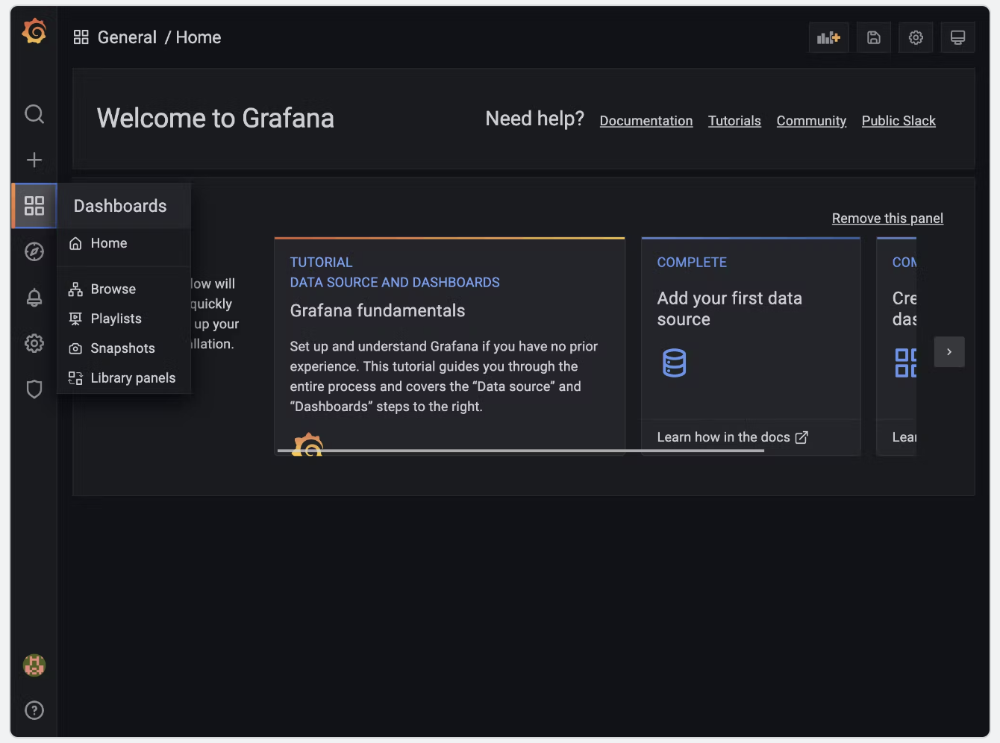
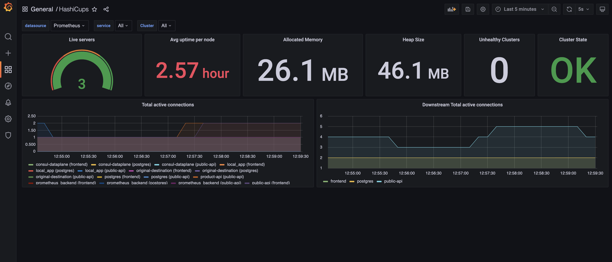

Disclaimer: This setup is for POC purposes and not fit for production

Grafana instructions Guide

This guide will show 2 dashboards, 1 for Hashicups and the other dashboard for the consul metrics.

Hashicups can be found in this repo

```
https://developer.hashicorp.com/consul/tutorials/kubernetes/kubernetes-layer7-observability

```
Forward frontend port to show hashicup service

```
kubectl port-forward deploy/frontend 8080:80

http://127.0.0.1:8080/
```


This will work from the back of the helm config file setup for helm in the original excercise.

Add Grafana helm to helm repo.

```
helm repo add grafana https://grafana.github.io/helm-charts

helm repo update

helm install -f helm/grafana-values.yaml grafana grafana/grafana --version "6.23.1" --debug
```

NOTES:
1. Get your 'admin' user password by running:
```
   kubectl get secret --namespace default grafana -o jsonpath="{.data.admin-password}" | base64 --decode ; echo
```
2. The Grafana server can be accessed via port 3000 on the following DNS name from within your cluster:

   grafana.default.svc.cluster.local

   Get the Grafana URL to visit by running these commands in the same shell:
```
     export POD_NAME=$(kubectl get pods --namespace default -l "app.kubernetes.io/name=grafana,app.kubernetes.io/instance=grafana" -o jsonpath="{.items[0].metadata.name}")
     kubectl --namespace default port-forward $POD_NAME 3000

     Navigate to http://localhost:3000 in a browser tab and log in to the Grafana UI using admin as the username and password as the password.

```

apply traffic to the service to show some metrics in the dashboard

```
kubectl apply -f traffic.yaml

```


Add consul into Grafana dashboard with instructions below:

Once you have logged into the Grafana UI, hover over the dashboards icon (four squares in the left-hand menu), and then click the Browse option.



This will take you to a page that gives you some choices about how to upload Grafana dashboards. Click the Import button on the right-hand side of the screen. Open the file in the grafana subdirectory named hashicups-dashboard.json (this file is in the Grafan directory in this repo) and copy the contents into the JSON window of the Grafana UI. 

Click through the rest of the options, and you will end up with a dashboard waiting for data to display. Make sure prometheus as input




