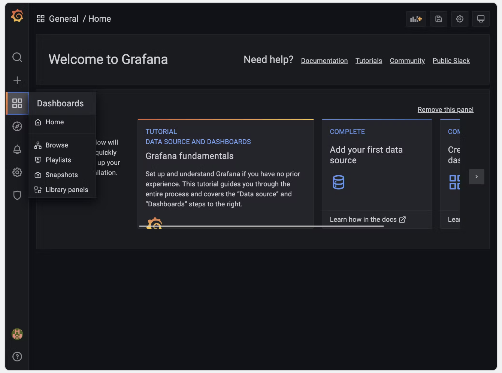

Disclaimer: This setup is for POC purposes and not fit for production

Grafana instructions Guide

This guide will show 2 dashboards, 1 for Hashicups and the other dashboard for the consul metrics.

Hashicups can be found in this repo

```
https://developer.hashicorp.com/consul/tutorials/kubernetes/kubernetes-layer7-observability

```
Forward frontend port to show hashicup service

```
kubectl port-forward deploy/frontend 8080:80

http://127.0.0.1:8080/
```


This will work from the back of the helm config file setup for helm in the original excercise.

Add Grafana helm to helm repo.

```
helm repo add grafana https://grafana.github.io/helm-charts

helm repo update

helm install -f helm/grafana-values.yaml grafana grafana/grafana --version "6.23.1" --debug
```

NOTES:
1. Get your 'admin' user password by running:
```
   kubectl get secret --namespace default grafana -o jsonpath="{.data.admin-password}" | base64 --decode ; echo
```
2. The Grafana server can be accessed via port 3000 on the following DNS name from within your cluster:

   grafana.default.svc.cluster.local

   Get the Grafana URL to visit by running these commands in the same shell:
```
     export POD_NAME=$(kubectl get pods --namespace default -l "app.kubernetes.io/name=grafana,app.kubernetes.io/instance=grafana" -o jsonpath="{.items[0].metadata.name}")
     kubectl --namespace default port-forward $POD_NAME 3000

     Navigate to http://localhost:3000 in a browser tab and log in to the Grafana UI using admin as the username and password as the password.

```


Add consul into Grafana dashboard with instructions below:

Once you have logged into the Grafana UI, hover over the dashboards icon (four squares in the left-hand menu), and then click the Browse option.




ingressGateways:
  defaults:
    replicas: 1
    service:
      ports:
      - nodePort: null
        port: 443
      - nodePort: null
        port: 8080
      type: LoadBalancer
  enabled: true
  gateways:
  - name: ingress-gateway

save config and upgrade helm chart with new ingress gateway bloxk (if required)

helm upgrade --install -f config-dc1.yaml consul hashicorp/consul -n consul --debug 
once completed check pods and service have been built

kubectl get pods -n consul

kubectl get svc -n consul
image

image

STEP BY STEP GUIDE on Installing Ingress Gateway.
This guide describes the following definitions and services needed :

Frontend service deployment
Backend service deployment
Ingress config.
service defaults
service router
service resolver
Default Deny as default
intention
port-forward ingress-gateway service
Setup steps
Deploy Frontend directory that will provision all the service above apart from the Backend services

kubectl apply -f Frontend/

image

Frontend service will deploy alongside your other services that you have already deployed.

The frontend service will have 2 services deployed a v1 and v2 to loadbalance the traffic and you will also see that the resolver only against frontend