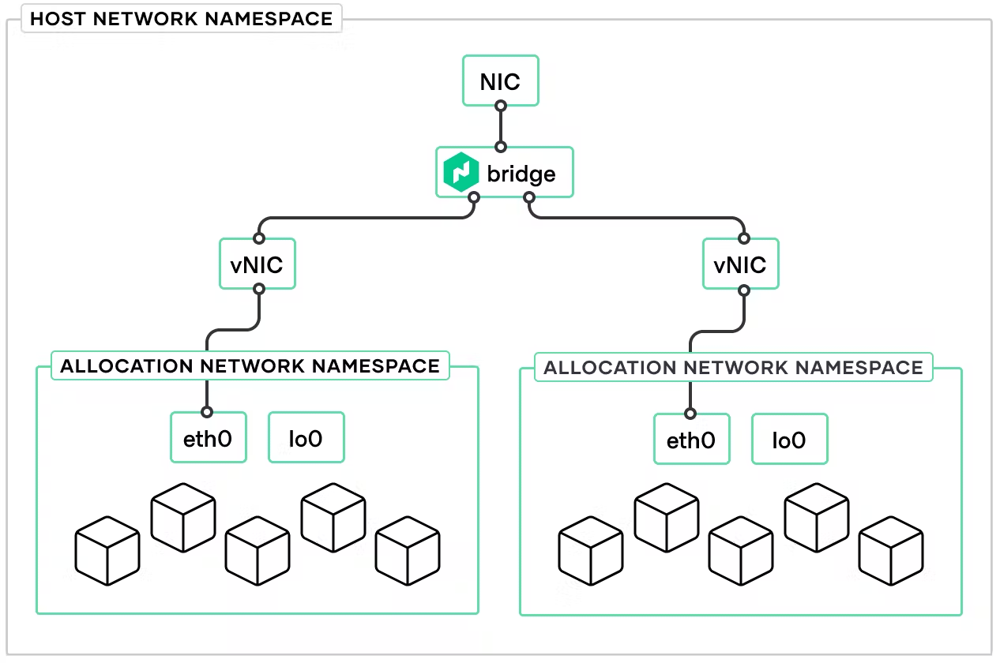

Disclaimer: This setup is for POC purposes and not fit for production

NOMAD Integration into Consul POC Guide




STEP 1 - Setup ACL & Policies on Consul server VM first

```
consul acl token create -node-identity 'host01:dc1'

AccessorID:       18ddc57f-72e6-2b4f-9b20-b8c8d58d41d7
SecretID:         e7fc8ebd-8234-2316-15fe-f59d4f7a5463
Description:
Local:            false
Create Time:      2023-11-15 18:06:59.674682 -0500 EST
Node Identities:
   host01 (Datacenter: dc1)


consul acl set-agent-token agent <SecretID> AS ABOVE line 14

ACL token "agent" set successfully

### Create a file named consul-policy-nomad-agents.hcl to store the Consul ACL rules that grant the necessary permissions to Nomad agents. 
### Add the following contents to it and save the file

consul-policy-nomad-agents.hcl

agent_prefix "" {
  policy = "read"
}

node_prefix "" {
  policy = "read"
}

service_prefix "" {
  policy = "write"
}

### Create a Consul ACL policy named nomad-agents with the rules defined in the consul-policy-nomad-agents.hcl file

consul acl policy create -name 'nomad-agents' -description 'Policy for Nomad agents' -rules '@consul-policy-nomad-agents.hcl'
ID:           7a0fe00b-f7e6-809c-2227-bb0638b873bd
Name:         nomad-agents
Description:  Policy for Nomad agents
Datacenters:
Rules:
agent_prefix "" {
  policy = "read"
}

node_prefix "" {
  policy = "read"
}

service_prefix "" {
  policy = "write"
}


consul acl token create -policy-name 'nomad-agents'
AccessorID:       3f436657-823a-95e3-4755-79f3e1e43c8e
SecretID:         df179fd2-3211-3641-5901-a57331c14611
Description:
Local:            false
Create Time:      2023-11-15 18:23:39.572365 -0500 EST
Policies:
   a5ee20ed-7158-89be-9a19-be213d106d24 - nomad-agents

### Save the value of SecretID for the Consul ACL token. You will use it below to configure Nomad

```

Install Nomad client
Install Nomad Binary &  plus toolsets Debian-based instructions:

```
wget -O- https://apt.releases.hashicorp.com/gpg | sudo gpg --dearmor -o /usr/share/keyrings/hashicorp-archive-keyring.gpg
echo "deb [signed-by=/usr/share/keyrings/hashicorp-archive-keyring.gpg] https://apt.releases.hashicorp.com $(lsb_release -cs) main" | sudo tee /etc/apt/sources.list.d/hashicorp.list
sudo apt update && sudo apt install nomad-enterprise jq net-tools

CNI Plugins

curl -L -o cni-plugins.tgz "https://github.com/containernetworking/plugins/releases/download/v1.0.0/cni-plugins-linux-$( [ $(uname -m) = aarch64 ] && echo arm64 || echo amd64)"-v1.0.0.tgz && \
  sudo mkdir -p /opt/cni/bin && \
  sudo tar -C /opt/cni/bin -xzf cni-plugins.tgz


```
```
nomad --version
```
```
### nomad.hcl file - dont forget to create a nomad.hclic license file

# Copyright (c) HashiCorp, Inc.
# SPDX-License-Identifier: BUSL-1.1

# Full configuration options can be found at https://developer.hashicorp.com/nomad/docs/configuration

data_dir  = "/opt/nomad/data"
bind_addr = "172.31.30.79"

server {
  # license_path is required for Nomad Enterprise as of Nomad v1.1.1+
  license_path = "/etc/nomad.d/nomad.hclic"
  enabled          = true
  bootstrap_expect = 1
}

client {
  enabled = true
  servers = ["172.31.30.79"]
}

plugin "raw_exec" {
  config {
    enabled = true
  }
}

acl {
  enabled = true
}


consul {
  address = "172.31.28.218:8500"
#  token   = "df179fd2-3211-3641-5901-a57331c14611"
  token   = "8e29317f-2f48-138b-665f-71054ade9dbe"

service_identity {
    aud = ["consul.io"]
    ttl = "1h"
  }

  task_identity {
    aud = ["consul.io"]
    ttl = "1h"
  }
}

telemetry {
  publish_allocation_metrics = true
  publish_node_metrics       = true
}

audit {
  enabled = true
}

```


```
systemctl daemon-reload
systemctl enable nomad 
systemctl start nomad 

```

```
nomad acl boostrap

Accessor ID  = 6cc614f4-db5d-8022-e839-df99a5588bb0
Secret ID    = df6d3b3f-44d9-f774-24cd-a3e7c3953a7f
Name         = Bootstrap Token
Type         = management
Global       = true
Create Time  = 2024-01-17 15:25:02.674365346 +0000 UTC
Expiry Time  = <none>
Create Index = 12
Modify Index = 12
Policies     = n/a
Roles        = n/a

```

```

export NOMAD_TOKEN=df6d3b3f-44d9-f774-24cd-a3e7c3953a7f
export NOMAD_ADDR=http://172.31.30.79:4646 ##### UI IP address to access GUI

nomad server members
nomad node status


```

