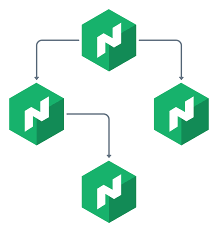

Disclaimer: This setup is for POC purposes and not fit for production

NOMAD Integration into Consul POC Guide





```
Once you have setup consul & Nomad server which i have provided in th consulvm repo folders
```

STEP 1 - Setup ACL & Policies on Consul server VM first

```
consul acl token create -node-identity 'host01:dc1'

AccessorID:       18ddc57f-72e6-2b4f-9b20-b8c8d58d41d7
SecretID:         e7fc8ebd-8234-2316-15fe-f59d4f7a5463
Description:
Local:            false
Create Time:      2023-11-15 18:06:59.674682 -0500 EST
Node Identities:
   host01 (Datacenter: dc1)


consul acl set-agent-token agent <SecretID> AS ABOVE line 14

ACL token "agent" set successfully
```

### Create a file named consul-policy-nomad-agents.hcl to store the Consul ACL rules that grant the necessary permissions to Nomad agents. 
### Add the following contents to it and save the file

```
consul-policy-nomad-agents.hcl

agent_prefix "" {
  policy = "read"
}

node_prefix "" {
  policy = "read"
}

service_prefix "" {
  policy = "write"
}
```

### Create a Consul ACL policy named nomad-agents with the rules defined in the consul-policy-nomad-agents.hcl file

```
consul acl policy create -name 'nomad-agents' -description 'Policy for Nomad agents' -rules '@consul-policy-nomad-agents.hcl'
ID:           7a0fe00b-f7e6-809c-2227-bb0638b873bd
Name:         nomad-agents
Description:  Policy for Nomad agents
Datacenters:
Rules:
agent_prefix "" {
  policy = "read"
}

node_prefix "" {
  policy = "read"
}

service_prefix "" {
  policy = "write"
}

```
```
consul acl token create -policy-name 'nomad-agents'
AccessorID:       3f436657-823a-95e3-4755-79f3e1e43c8e
SecretID:         df179fd2-3211-3641-5901-a57331c14611
Description:
Local:            false
Create Time:      2023-11-15 18:23:39.572365 -0500 EST
Policies:
   a5ee20ed-7158-89be-9a19-be213d106d24 - nomad-agents

### Save the value of SecretID for the Consul ACL token. You will use it below to configure Nomad

```


Install Nomad client, docker (do not install snap version)
Install Nomad Binary &  plus toolsets Debian-based instructions:

```
wget -O- https://apt.releases.hashicorp.com/gpg | sudo gpg --dearmor -o /usr/share/keyrings/hashicorp-archive-keyring.gpg
echo "deb [signed-by=/usr/share/keyrings/hashicorp-archive-keyring.gpg] https://apt.releases.hashicorp.com $(lsb_release -cs) main" | sudo tee /etc/apt/sources.list.d/hashicorp.list
sudo apt update && sudo apt install nomad-enterprise jq net-tools

CNI Plugins

curl -L -o cni-plugins.tgz "https://github.com/containernetworking/plugins/releases/download/v1.0.0/cni-plugins-linux-$( [ $(uname -m) = aarch64 ] && echo arm64 || echo amd64)"-v1.0.0.tgz && \
  sudo mkdir -p /opt/cni/bin && \
  sudo tar -C /opt/cni/bin -xzf cni-plugins.tgz
```

```
nomad --version
```

```
### nomad.hcl file - dont forget to create a nomad.hclic license file

# Copyright (c) HashiCorp, Inc.
# SPDX-License-Identifier: BUSL-1.1

# Full configuration options can be found at https://developer.hashicorp.com/nomad/docs/configuration

data_dir  = "/opt/nomad/data"
bind_addr = "172.31.30.79"

server {
  # license_path is required for Nomad Enterprise as of Nomad v1.1.1+
  license_path = "/etc/nomad.d/nomad.hclic"
  enabled          = true
  bootstrap_expect = 1
}

client {
  enabled = true
  servers = ["172.31.30.79"]
}

plugin "raw_exec" {
  config {
    enabled = true
  }
}

acl {
  enabled = true
}


consul {
  address = "172.31.28.218:8500"
#  token   = "df179fd2-3211-3641-5901-a57331c14611"
  token   = "8e29317f-2f48-138b-665f-71054ade9dbe"

service_identity {
    aud = ["consul.io"]
    ttl = "1h"
  }

  task_identity {
    aud = ["consul.io"]
    ttl = "1h"
  }
}

telemetry {
  publish_allocation_metrics = true
  publish_node_metrics       = true
}

audit {
  enabled = true
}

```


```
systemctl daemon-reload
systemctl enable nomad 
systemctl start nomad 

```

```
nomad acl boostrap

Accessor ID  = 6cc614f4-db5d-8022-e839-df99a5588bb0
Secret ID    = df6d3b3f-44d9-f774-24cd-a3e7c3953a7f
Name         = Bootstrap Token
Type         = management
Global       = true
Create Time  = 2024-01-17 15:25:02.674365346 +0000 UTC
Expiry Time  = <none>
Create Index = 12
Modify Index = 12
Policies     = n/a
Roles        = n/a

```

```

export NOMAD_TOKEN=df6d3b3f-44d9-f774-24cd-a3e7c3953a7f
export NOMAD_ADDR=http://172.31.30.79:4646 ##### UI IP address to access GUI

nomad server members
nomad node status
```

Nomad client

Configure Consul for services workload identities
Create a Consul ACL JWT auth method

```
vi consul-auth-method-nomad-workloads.json

{
  "JWKSURL": "http://172.31.30.79:4646/.well-known/jwks.json",
  "JWTSupportedAlgs": ["RS256"],
  "BoundAudiences": ["consul.io"],
  "ClaimMappings": {
    "nomad_namespace": "nomad_namespace",
    "nomad_job_id": "nomad_job_id",
    "nomad_task": "nomad_task",
    "nomad_service": "nomad_service"
  }
}

```

```
consul acl auth-method create -name 'nomad-workloads' -type 'jwt' -description 'JWT auth method for Nomad services and workloads' -config '@consul-auth-method-nomad-workloads.json'

```

Create a Consul ACL binding rule for Nomad services

```
consul acl binding-rule create -method 'nomad-workloads' -description 'Binding rule for services registered from Nomad' -bind-type 'service' -bind-name '${value.nomad_service}' -selector '"nomad_service" in value'
```

Run a Nomad job to register a service in Consul

```
vi httpd.nomad.hcl


job "httpd" {
  group "httpd" {
    network {
      port "http" {}
    }

    service {
      provider = "consul"
      name     = "httpd"
      port     = "http"
    }

    task "httpd" {
      driver = "docker"

      config {
        image   = "busybox:1.36"
        command = "httpd"
        args    = ["-f", "-p", "${NOMAD_PORT_http}"]
        ports   = ["http"]
      }
    }
  }
}
```

```
nomad job run 'httpd.nomad.hcl'

nomad job inspect -t '{{sprig_toPrettyJson (index .TaskGroups 0).Services}}' 'httpd'

```


Consul server - Configure Consul for tasks workload identities

Create a Consul ACL binding rule for Nomad tasks
Create a binding rule to map ACL tokens from the nomad-workloads auth method to ACL roles with names that match the pattern nomad-tasks-${value.nomad_namespace}.

```
consul acl binding-rule create -method 'nomad-workloads' -description 'Binding rule for Nomad tasks' -bind-type 'role' -bind-name 'nomad-tasks-${value.nomad_namespace}' -selector '"nomad_service" not in value'
```

The value of ${value.nomad_namespace} is dynamically set to the Nomad namespace of the workload requesting the Consul token. You can also use other values from the auth method ClaimMappings, such as nomad_job_id and nomad_task for more fine-grained mapping of roles.

The -selector '"nomad_service" not in value' flag ensures this rule only applies to workload identities that are not used for service registration because they do not have the nomad_service claim.

Create a Consul ACL policy for Nomad tasks
Create a file named consul-policy-nomad-tasks.hcl. Add the following contents to it and save the file. This policy allows tokens to access any service and KV path in Consul. In production environments, you should adjust the policy should to meet specific access requirements.

```
vi consul-policy-nomad-tasks.hcl

key_prefix "" {
  policy = "read"
}

service_prefix "" {
  policy = "read"
}
```

Create a Consul ACL role for Nomad tasks
Create a Consul ACL role named nomad-tasks-default that matches the name pattern for jobs in the default namespace using the rules set in the file consul-policy-nomad-tasks.hcl.

```
consul acl role create -name 'nomad-tasks-default' -description 'ACL role for Nomad tasks in the default Nomad namespace' -policy-name 'nomad-tasks'

```

Run a Nomad job to read data from Consul
Write test data to Consul's KV store.

```
consul kv put 'httpd/config/cache' '50'; consul kv put 'httpd/config/maxconn' '100'; consul kv put 'httpd/config/minconn' '3'
```

```
vi consul-info.nomad.hcl

job "consul-info" {
  type = "batch"

  group "consul-info" {
    task "consul-info" {
      driver = "docker"

      consul {}

      config {
        image   = "busybox:1.36"
        command = "/bin/sh"
        args    = ["-c", "exit 0"]
      }

      template {
        data        = <<EOF
Consul Services:
{{- range services}}
  * {{.Name}}{{end}}

Consul KV for "httpd/config":
{{- range ls "httpd/config"}}
  * {{.Key}}: {{.Value}}{{end}}
EOF
        destination = "local/consul-info.txt"
      }
    }
  }
}

```

```
nomad job run 'consul-info.nomad.hcl'

nomad job allocs 'consul-info'

nomad alloc fs "$(nomad job allocs -t '{{with index . 0}}{{.ID}}{{end}}' 'consul-info')" 'consul-info/local/consul-info.txt'

nomad job inspect -t '{{sprig_toPrettyJson (index (index .TaskGroups 0).Tasks 0)}}' 'consul-info'
```


GOD JOB....... AL DONE 😁😁😁😁😁😁😁😁


